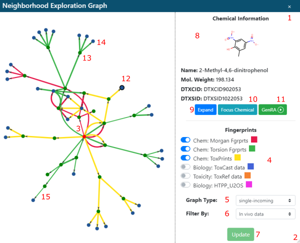

The Nearest Neighbor Explorer (below) lets you interact with neighbors visually
across multiple finger print (FP) types.  Use `1` to close it or the lower
right corner triangle `2` to resize the pop-up.  The target chemical `3` is
colored red, the three most similar neighbors for the enabled fingerprint types
`4` are shown with color coded arrows.  Changes to the enabled FP, graph type
`5` or neighbor data availability filter `6` are only applied when you click
Update `7`. *Note:* for technical reasons "Chem:" fingerprints are only available
when a filter other than "No filter" is used.

Neighbors are green `13` when they are "expanded" (their neighbors are shown)
or blue `14` when their neighbors are not shown.  A neighbor can be selected by
clicking `12`, it is then indicated with a black outline.  Basic information
`8` about the selected neighbor is shown.  The selected neighbor can be
expanded `9` to show its neighbors, focused `10` to re-center the neighbor in
the display, or used as a new target chemical for a new GenRA session `11`.
NOTE: clicking the green GenRA button will start a completely new GenRA session
without retaining any current selections.
Neighbors connected by thicker arrows are more similar that neighbors connected
by thinner arrows `15`.

